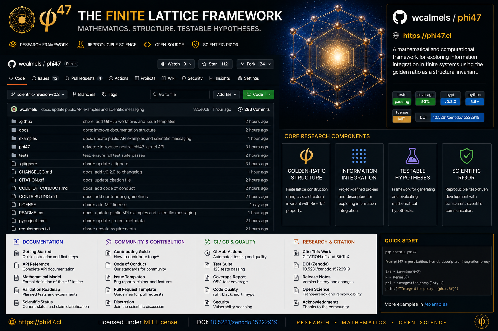

# Phi47

**Phi47** is an independent scientific software framework for constructing and studying finite complex lattices, deterministic numerical kernels, integration proxies, and phenomenological descriptors.



## Project scope

The repository provides:

- a reproducible finite-lattice implementation;
- a canonical numerical kernel with compatibility aliases;
- an integration proxy intended for numerical exploration;
- phenomenological descriptor objects for structured experiments;
- tests, examples, and explicit scientific-status classification.

## Scientific position

Phi47 distinguishes between:

- mathematical identities and direct derivations;
- numerically verified properties;
- empirical claims;
- conjectures and research hypotheses;
- phenomenological interpretations.

The software does **not** treat speculative interpretation as experimental confirmation. See [Scientific status](science/SCIENTIFIC_STATUS.md).

## Quick start

```bash
python -m pip install -e ".[dev]"
python -m pytest -q
```

```python
from phi47 import (
    Phi47Lattice,
    PhenomenologicalDescriptorEngine,
    integration_proxy,
    phi47_kernel,
)

lattice = Phi47Lattice(dim=11).build()
kernel_value = phi47_kernel(47)
proxy_value = integration_proxy(lattice.matrix)

engine = PhenomenologicalDescriptorEngine(lattice)
descriptor = engine.generate("math_prime", 47.0)

print(kernel_value)
print(proxy_value)
print(descriptor)
```

## Repository

- Owner: `wcalmels`
- Repository: `wcalmels/phi47`
- Website: `https://phi47.cl`
- Contact: `wcalmels@phi47.cl`
